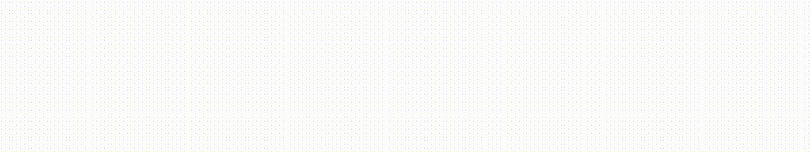

# Directional

A widget that performs a directional animation on its child widget.

## Preview



## Constructor

```dart
const DirectionalAnimation({
  required this.child,
  required this.delay,
  required this.direction,
  Curve? curve,
  super.key,
})
```

Example:

```dart
DirectionalAnimation(
  child: MyWidget(),
  delay: 200,
  direction: DirectionalAnimationDirection.left,
)
```
