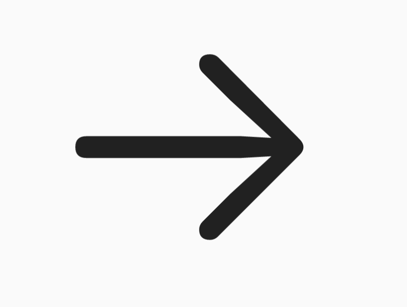

# Arrow

A widget that represents an arrow

## Preview



## Constructor

```dart
const Arrow({
  this.color,
  this.size = const Size(24, 24),
  super.key,
})
```

Example:

```dart
Arrow(
  color: Colors.black,
  size: Size(32, 32),
)
```
