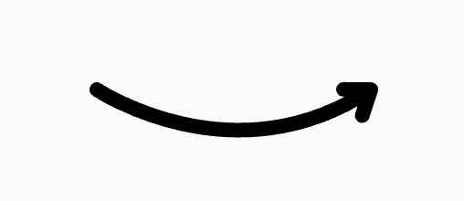

# Curvy Arrow

A widget that represents a curvy arrow.

## Preview



## Constructor

```dart
const CurvyArrow(
  this.height,
  this.width, {
  this.color,
  super.key,
})
```

Example:

```dart
CurvyArrow(
  100,
  200,
  color: Colors.blue,
)
```
