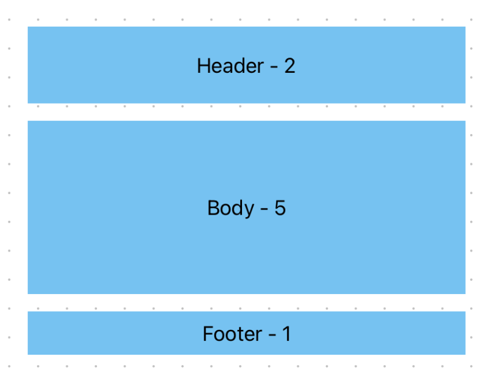

# Layout

Layouts are splitted into three parts: Header, Body and Footer.
Each of those have specific flexUnits. You can use those to
compose your custom slides easier.

## Preview

## Widgets

- LayoutHeader
- LayoutBody
- LayoutFooter
