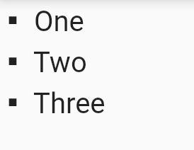

# List Text

A widget that displays a list of texts with optional animations and bullet points.
Different bullets can be set by using different `ListBullets` values.

## Preview



## Constructor

```dart
const ListText({
  required this.texts,
  this.animationIndex,
  this.animationArguments,
  this.style,
  this.textAlign,
  this.bullet,
  this.padding,
  super.key,
})
```

Example:

```dart
ListText(
  texts: ["One", "Two", "Three"],
  style: TextStyle(fontSize: 20),
  bullet: ListBullets.square,
)
```
