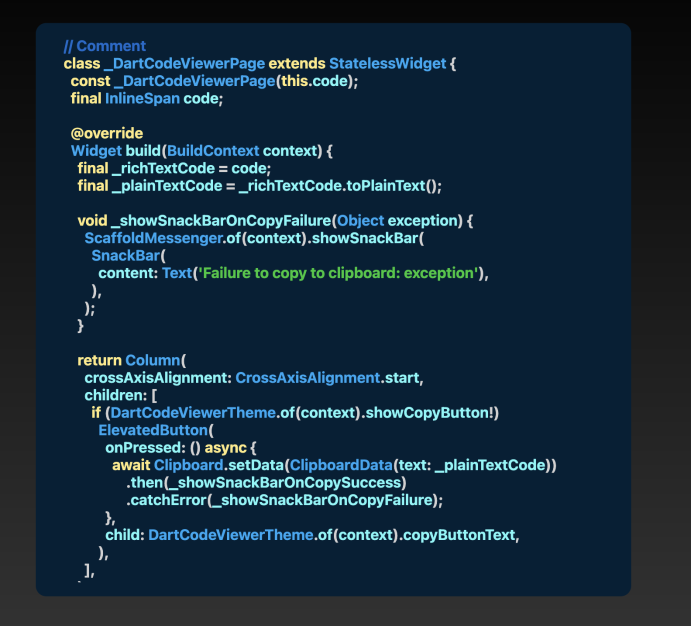

# Code Display

A widget that will show your code in an elegant way.
The best thing about it, you don't need to format your code for this to work!
There are a lot of prebuilt styles, that can be used `CodeDisplayColorThemes`.

## Preview



## Constructor

```dart
CodeDisplay(
  this.code, {
  this.codeColorTheme,
  this.width,
  this.height,
  this.showCopyButton,
  this.copyButtonReplacement,
  this.boxDecoration,
  this.commentTextStyle,
  this.baseTextStyle,
  this.classTextStyle,
  this.keywordTextStyle,
  this.stringTextStyle,
  this.punctuationTextStyle,
  this.padding,
  super.key,
})
```

- `code` (required): The code to be displayed.
- `showCopyButton`: Determines if the copy for code button should be shown.
- `copyButtonReplacement`: If `showCopyButton` is set, by default an elevated button will be shown. To provide a custom copy button, this property can be used.
- `height`: The height of the code display.
- `width`: The width of the code display.
- `codeColorTheme`: The color theme for syntax highlighting.
- `boxDecoration`: The box decoration of the code display.
- `commentTextStyle`: The text style for comments.
- `baseTextStyle`: The base text style.
- `classTextStyle`: The text style for classes.
- `keywordTextStyle`: The text style for keywords.
- `stringTextStyle`: The text style for strings.
- `punctuationTextStyle`: The text style for punctuation.
- `padding`: The padding of the container.

Example:

Yes, this is a valid example 😉. Try it for yourself!

```dart
CodeDisplay(
                  """
// Comment
     class _DartCodeViewerPage extends StatelessWidget {
const _DartCodeViewerPage(this.code);
          final InlineSpan code;

    @override
          Widget build(BuildContext context) {
       final _richTextCode = code;
final _plainTextCode = _richTextCode.toPlainText();

        void _showSnackBarOnCopySuccess(dynamic result) {
       ScaffoldMessenger.of(context).showSnackBar(     const SnackBar( content: Text('Copied to Clipboard'),
      ),
           );
  }

       void _showSnackBarOnCopyFailure(Object exception) {ScaffoldMessenger.of(context).showSnackBar( SnackBar(


              content: Text('Failure to copy to clipboard: exception'),
  ),
          );
  }

  return Column(
     crossAxisAlignment: CrossAxisAlignment.start,
              children: [
      if (DartCodeViewerTheme.of(context).showCopyButton!)
        ElevatedButton(
          onPressed: () async {
   await Clipboard.setData(ClipboardData(text: _plainTextCode)) .then(_showSnackBarOnCopySuccess)
                .catchError(_showSnackBarOnCopyFailure);
          },
                child: DartCodeViewerTheme.of(context).copyButtonText,
        ),
               Expanded(
          child: SingleChildScrollView(
              child: SelectableText.rich(
    TextSpan(
              text: "",
    children: [_richTextCode],
                style: const TextStyle(fontWeight: FontWeight.bold),
   ),
              textDirection: TextDirection.ltr,
             ))),
            ],
  );
  }
  }
""",
                  width: 700,
                  codeColorTheme: CodeDisplayColorThemes.shadesOfPurple,
                  classTextStyle: TextStyle(color: Colors.yellow),
                  padding: allPadding16,
                  boxDecoration: BoxDecoration(
                    borderRadius: BorderRadius.all(
                      Radius.circular(12),
                    ),
                  ),
                  showCopyButton: true,
                  copyButtonReplacement: Align(
                    alignment: Alignment.topRight,
                    child: DecoratedBox(
                      decoration: BoxDecoration(
                        color: CodeDisplayColorThemes.shadesOfPurple.baseColor,
                        borderRadius: BorderRadius.circular(8),
                      ),
                      child: Padding(
                        padding: allPadding16,
                        child: Text(
                          'Copy',
                          style: TextStyle(
                            color: Colors.black,
                          ),
                        ),
                      ),
                    ),
                  ),
                ),
```
