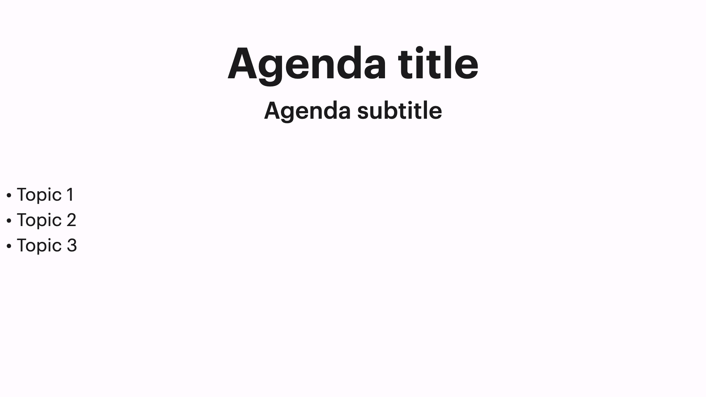

# Base

## Example



```dart
KeynoteAgendaSlide(
    titleText: 'Agenda title',
    subTitleText: 'Agenda subtitle',
    titleStyle: KeynoteTextstyles.title(),
    subtitleStyle: KeynoteTextstyles.subtitle(),
    footerAlignment: Alignment.centerRight,
    subtitleFooterSpacing: verticalMargin12,
    bodyFlexUnits: 2,
    footerFlexUnits: 5,
    footerWidget: ListText(
      texts: const ["Topic 1", "Topic 2", "Topic 3"],
      style: KeynoteTextstyles.body(),
      bullet: ListBullets.circle,
    ),
    padding: allPadding16,
  ),
)
```

## Properties

The `KeynoteAgendaSlide` widget provides several properties to customize its appearance and behavior:

- `titleText` (required): The text for the slide title.
- `subTitleText`: The text for the slide subtitle.
- `titleStyle`: The text style for the slide title.
- `subtitleStyle`: The text style for the slide subtitle.
- `titleAlignment`: The alignment for the slide title.
- `subtitleAlignment`: The alignment for the slide subtitle.
- `footerAlignment`: The alignment for the slide footer.
- `titleTextAlignment`: The text alignment for the slide title.
- `subtitleTextAlignment`: The text alignment for the slide subtitle.
- `titleSubTitleSpacing`: The widget to specify spacing between the title and subtitle.
- `subtitleFooterSpacing`: The widget to specify spacing between the subtitle and footer.
- `padding`: The padding for the slide.
- `headerFlexUnits`: The flex units for the slide header.
- `bodyFlexUnits`: The flex units for the slide body.
- `footerFlexUnits`: The flex units for the slide footer.
- `titleWidgetReplacement`: The replacement widget for the slide title.
- `subtitleWidgetReplacement`: The replacement widget for the slide subtitle.
- `footerWidget`: The widget for the slide footer.
- `animationIndex`: The index at which the animation should start.
- `animationArguments`: The animation arguments for the slide animation.
