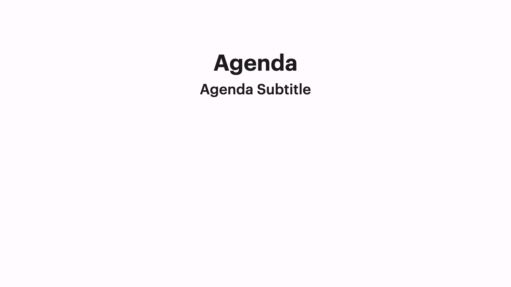

# Variations

## Variation 1

### Preview



```dart
KeynoteAgendaSlideVariants.variantOne(
  titleText: "Agenda",
  subTitleText: "Agenda Subtitle",
)
```

### Constructor

```dart
KeynoteAgendaSlide variantOne({
    required String titleText,
    required String subTitleText,
    TextStyle? titleStyle,
    TextStyle? subtitleStyle,
    TextAlign? titleTextAlignment,
    TextAlign? subtitleTextAlignment,
    Alignment? titleAlignment,
    Alignment? subtitleAlignment,
    Alignment? footerAlignment,
    Widget? titleSubTitleSpacing,
    Widget? subtitleFooterSpacing,
    EdgeInsets? padding,
    int? headerFlexUnits,
    int? bodyFlexUnits,
    int? footerFlexUnits,
    Widget? titleWidgetReplacement,
    Widget? subtitleWidgetReplacement,
    Widget? footerWidget,
    int? animationIndex,
    AnimationArguments? animationArguments,
  }) =>
      KeynoteAgendaSlide(
        titleText: titleText,
        subTitleText: subTitleText,
        titleStyle: titleStyle ?? KeynoteTextstyles.titleSmall(),
        subtitleStyle: subtitleStyle ?? KeynoteTextstyles.subtitleSmall(),
        titleTextAlignment: titleTextAlignment,
        subtitleTextAlignment: subtitleTextAlignment,
        titleAlignment: titleAlignment ?? Alignment.bottomCenter,
        subtitleAlignment: subtitleAlignment ?? Alignment.topCenter,
        footerAlignment: footerAlignment,
        titleSubTitleSpacing: titleSubTitleSpacing,
        subtitleFooterSpacing: subtitleFooterSpacing,
        padding: padding,
        headerFlexUnits: headerFlexUnits,
        bodyFlexUnits: bodyFlexUnits,
        footerFlexUnits: footerFlexUnits,
        titleWidgetReplacement: titleWidgetReplacement,
        subtitleWidgetReplacement: subtitleWidgetReplacement,
        footerWidget: footerWidget,
        animationIndex: animationIndex,
        animationArguments: animationArguments,
      );
```

## Variation 2

### Preview


```dart
KeynoteAgendaSlideVariants.variantTwo(
  titleText: "Agenda",
  subTitleText: "Agenda Subtitle",
)
```

### Constructor

```dart
  KeynoteAgendaSlide variantTwo({
    required String titleText,
    required String subTitleText,
    TextStyle? titleStyle,
    TextStyle? subtitleStyle,
    TextAlign? titleTextAlignment,
    TextAlign? subtitleTextAlignment,
    Alignment? titleAlignment,
    Alignment? subtitleAlignment,
    Alignment? footerAlignment,
    Widget? titleSubTitleSpacing,
    Widget? subtitleFooterSpacing,
    EdgeInsets? padding,
    int? headerFlexUnits,
    int? bodyFlexUnits,
    int? footerFlexUnits,
    Widget? titleWidgetReplacement,
    Widget? subtitleWidgetReplacement,
    Widget? footerWidget,
    int? animationIndex,
    AnimationArguments? animationArguments,
  }) =>
      KeynoteAgendaSlide(
        titleText: titleText,
        subTitleText: subTitleText,
        titleStyle: titleStyle ?? KeynoteTextstyles.titleSmall(),
        subtitleStyle: subtitleStyle ?? KeynoteTextstyles.subtitle(),
        titleTextAlignment: titleTextAlignment,
        subtitleTextAlignment: subtitleTextAlignment,
        titleAlignment: titleAlignment ?? Alignment.bottomLeft,
        subtitleAlignment: subtitleAlignment ?? Alignment.topLeft,
        footerAlignment: footerAlignment,
        titleSubTitleSpacing: titleSubTitleSpacing,
        subtitleFooterSpacing: subtitleFooterSpacing,
        padding: padding ?? allPadding48,
        headerFlexUnits: headerFlexUnits,
        bodyFlexUnits: bodyFlexUnits,
        footerFlexUnits: footerFlexUnits,
        titleWidgetReplacement: titleWidgetReplacement,
        subtitleWidgetReplacement: subtitleWidgetReplacement,
        footerWidget: footerWidget,
        animationIndex: animationIndex,
        animationArguments: animationArguments,
      );
```
