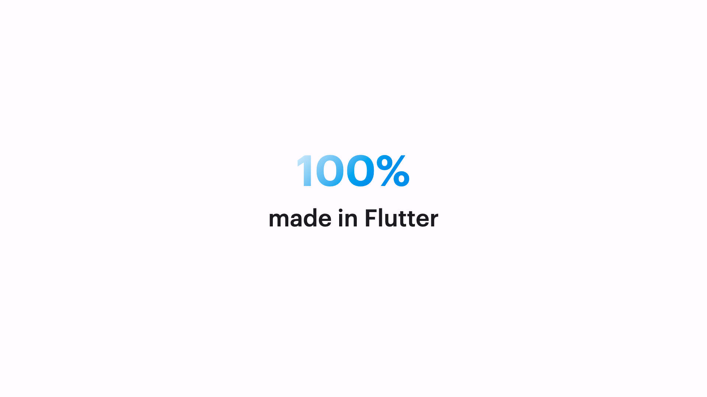

# Base

## Example



```dart
KeynoteBigFactSlide(
  titleText: '100%',
  subTitleText: 'made in Flutter',
  titleGradient: const LinearGradient(
    begin: Alignment.topLeft,
    end: Alignment.bottomCenter,
    colors: [Colors.white, Colors.blue],
  ),
  titleStyle: KeynoteTextstyles.title(),
  subtitleStyle: KeynoteTextstyles.subtitle(),
  padding: allPadding16,
)
```

## Properties

The `KeynoteBigFactSlide` widget provides several properties to customize its appearance and behavior:

- `titleText` (required): The text for the slide title.
- `subTitleText`: The text for the slide subtitle.
- `titleGradient`: The gradient used for the slide title background.
- `titleStyle`: The style for the slide title.
- `subtitleStyle`: The style for the slide subtitle.
- `titleAlignment`: The alignment for the slide title.
- `subtitleAlignment`: The alignment for the slide subtitle.
- `titleSubTitleSpacing`: The widget to provide spacing between the title and subtitle.
- `padding`: The padding for the slide.
- `headerFlexUnits`: The flex units for the header section.
- `bodyFlexUnits`: The flex units for the body section.
- `titleWidgetReplacement`: The replacement widget for the slide title.
- `subtitleWidgetReplacement`: The replacement widget for the slide subtitle.
- `animationIndex`: The index at which the animation should start.
- `animationArguments`: The animation arguments for the slide animation.
