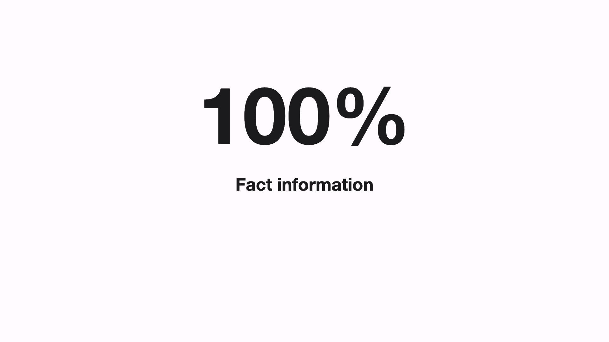

# Variations

## Variation 1

### Preview


```dart
KeynoteBigFactSlideVariants.variantOne(
  titleText: '100%',
  subTitleText: 'Fact information',
  gradient: KeynoteGradients.quoteGradient,
)
```

### Constructor

```dart
KeynoteBigFactSlide variantOne({
    required String titleText,
    required String subTitleText,
    required Gradient gradient,
    int? animationIndex,
    AnimationArguments? animationArguments,
  }) =>
      KeynoteBigFactSlide(
        titleText: titleText,
        subTitleText: subTitleText,
        titleGradient: gradient,
        titleStyle: KeynoteTextstyles.fact(),
        subtitleStyle: KeynoteTextstyles.subtitle(),
        animationIndex: animationIndex,
        animationArguments: animationArguments,
      )
```

## Variation 2

### Preview



```dart
KeynoteBigFactSlideVariants.variantTwo(
  titleText: '100%',
  subTitleText: 'Fact information',
)
```

### Constructor

```dart
KeynoteBigFactSlide variantTwo({
    required String titleText,
    required String subTitleText,
    int? animationIndex,
    AnimationArguments? animationArguments,
  }) =>
      KeynoteBigFactSlide(
        titleText: titleText,
        subTitleText: subTitleText,
        titleStyle: KeynoteTextstyles.fact(variant: Variants.two),
        subtitleStyle: KeynoteTextstyles.subtitle(variant: Variants.two),
        animationIndex: animationIndex,
        animationArguments: animationArguments,
      )
```
