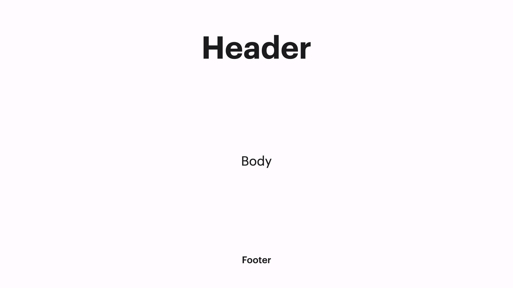

# Blank

## Example



```dart
KeynoteBlankSlide(
  headerWidget: Text(
    'Header',
    style: KeynoteTextstyles.title(),
  ),
  bodyWidget: Text(
    'Body',
    style: KeynoteTextstyles.body(),
  ),
  footerWidget: Text(
    'Footer',
    style: KeynoteTextstyles.footer(),
  ),
)
```

## Properties

The `KeynoteBlankSlide` widget provides several properties to customize its appearance and behavior:

- `headerWidget`: The widget for the slide header.
- `bodyWidget`: The widget for the slide body.
- `footerWidget`: The widget for the slide footer.
- `headerAlignment`: The alignment for the slide header.
- `bodyAlignment`: The alignment for the slide body.
- `footerAlignment`: The alignment for the slide footer.
- `titleBodySpacing`: The widget to provide spacing between the title and body.
- `bodyFooterSpacing`: The widget to provide spacing between the body and footer.
- `padding`: The padding for the slide.
- `headerFlexUnits`: The flex units for the header section.
- `bodyFlexUnits`: The flex units for the body section.
- `footerFlexUnits`: The flex units for the footer section.
- `animationIndex`: The index at which the animation should start.
- `animationArguments`: The animation arguments for the slide animation.
- `animationIndices`: The record of indices to control the animation of individual sections.
