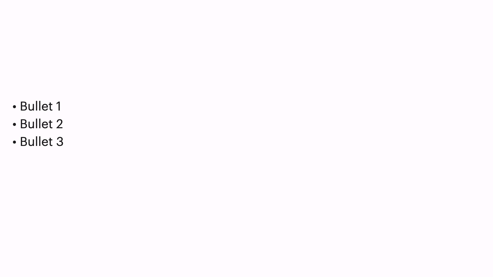

# Bullets

## Example



```dart
KeynoteBulletsSlide(
  bulletPoints: ["Bullet 1", "Bullet 2", "Bullet 3"],
)
```

## Properties

The `KeynoteBulletsSlide` widget provides several properties to customize its appearance and behavior:

- `bulletPoints` (required): The list of texts to display on the slide.
- `bullets`: The enum value representing the bullet style that should be displayed before each text.
- `bulletTextStyle`: The text style for the bullet points.
- `bulletPointsAlignment`: The alignment for the bullet points.
- `bulletTextAlignment`: The text alignment for the bullet points.
- `bulletPointsPadding`: The padding for the bullet points.
- `padding`: The padding for the slide.
- `footerFlexUnits`: The flex units for the footer section.
- `bulletPointsWidgetReplacement`: The widget replacement for the bullet points section.
- `animationIndex`: The index at which the animation should start.
- `animationArguments`: The animation arguments for the slide animation.
