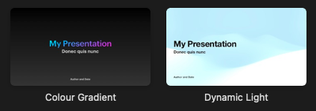

# Introduction

Check package out on: [Pub.dev](https://pub.dev/packages/fluttershow_keynote)

Introducing FlutterShow Keynote a library that implements all slides of the popular Keynote software
in Flutter. Designed specifically for the FlutterShow project: https://github.com/lucas-goldner/FlutterShow.

## Variants Version (Quick prebuilt styles)

The Variants version of FlutterShow Keynote is perfect for quickly building slides with predefined variations. It provides a set of prebuilt slides with styles that can be easily customized and combined to create visually appealing and dynamic slides. This version is ideal if you want to quickly build simple slides.

There are two variants, variant one is based on the Colour Gradient slide and the second one is based on the Dynamic Light.

## Base Version (Very customizable)

Unlike the Variants version, the Base version slides in FlutterShow Keynote are like blank canvases, waiting for your creative touch. These slides don't come with predefined styles, giving you complete control. Use it to craft slides that perfectly align with your desired aesthetics and functionality, unbounded by preset designs.
