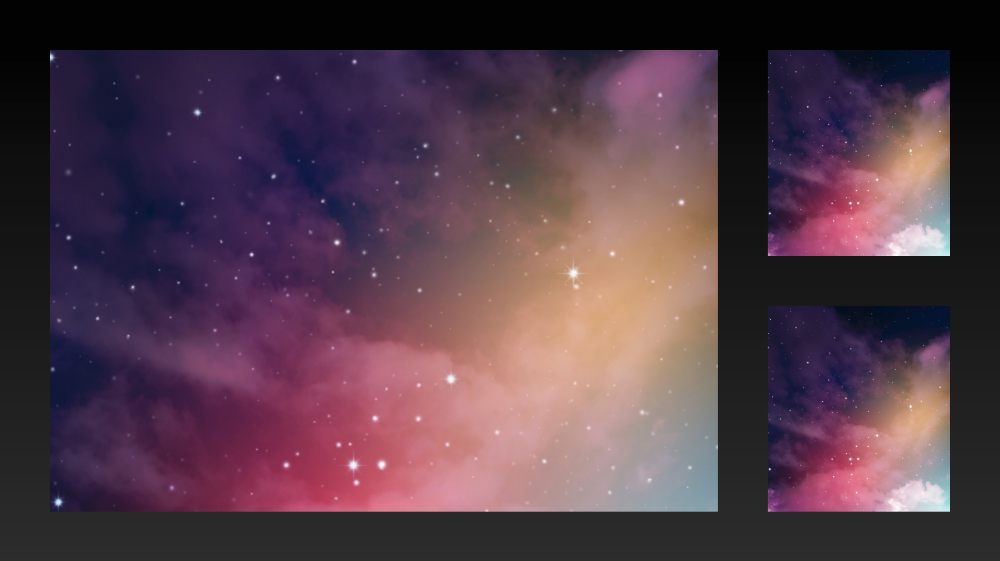

# Photo 3 Up

## Example



```dart
final size = MediaQuery.sizeOf(context);

KeynotePhoto3UpSlide(
  padding: allPadding48,
  imagesPadding: allPadding48,
  bigImage: Image.asset(
    'assets/images/title_and_photo_slide_alt/title_and_photo_image_alt.png',
    height: size.height,
    width: size.width,
    fit: BoxFit.cover,
  ),
  smallImageOne: Image.asset(
    'assets/images/title_and_photo_slide_alt/title_and_photo_image_alt.png',
    fit: BoxFit.cover,
  ),
  smallImageTwo: Image.asset(
    'assets/images/title_and_photo_slide_alt/title_and_photo_image_alt.png',
    fit: BoxFit.cover,
  ),
)
```

## Properties

The `KeynotePhoto3UpSlide` widget provides several properties to customize its appearance and behavior:

- `bigImage` (required): The widget representing the large image to display.
- `smallImageOne` (required): The widget representing the first small image to display.
- `smallImageTwo` (required): The widget representing the second small image to display.
- `padding`: The padding for the slide.
- `imagesPadding`: The padding between the images.
- `animationIndex`: The index used for controlling the animation of the slide.
- `animationArguments`: The animation arguments for animating the slide.
