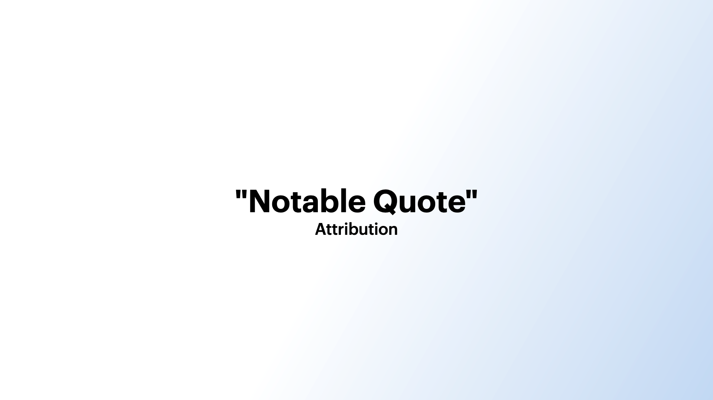

# Base

## Example



```dart
KeynoteQuoteSlide(
  quoteText: '"Notable Quote"',
  attributionText: 'Attribution',
  quoteStyle: KeynoteTextstyles.quote(),
  attributionStyle: KeynoteTextstyles.attribution(),
)
```

## Properties

The `KeynoteQuoteSlide` widget provides several properties to customize its appearance and behavior:

- `quoteText` (required): The text of the quote.
- `attributionText`: The optional text of the attribution.
- `quoteGradient`: The optional gradient to apply to the quote.
- `quoteStyle`: The optional style for the quote text.
- `attributionStyle`: The optional style for the attribution text.
- `quoteAlignment`: The optional alignment for the quote text.
- `quoteTextAlignment`: The text alignment for the slide quote.
- `attributionTextAlignment`: The text alignment for the slide attribution.
- `attributionAlignment`: The optional alignment for the attribution text.
- `quoteAttributionSpacing`: The optional spacing widget between the quote and attribution.
- `padding`: The optional padding around the slide.
- `headerFlexUnits`: The optional flex units for the header section.
- `bodyFlexUnits`: The optional flex units for the body section.
- `quoteWidgetReplacement`: The optional replacement widget for the quote text.
- `attributionWidgetReplacement`: The optional replacement widget for the attribution text.
- `animationIndex`: The optional index used for controlling the animation of the slide.
- `animationArguments`: The optional animation arguments for animating the slide.
