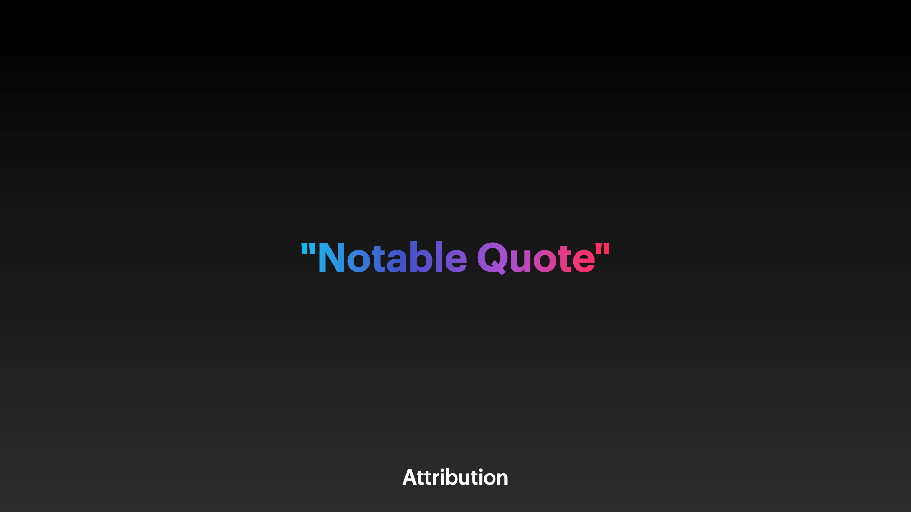

# Variations

## Variation 1

### Preview



```dart
KeynoteQuoteSlideVariants.variantOne(
  quoteText: '"Notable Quote"',
  attributionText: 'Attribution',
  gradient: FSGradients.titlePrimary,
)
```

### Constructor

```dart
KeynoteQuoteSlide variantOne({
    required String quoteText,
    required String attributionText,
    required Gradient gradient,
    int? animationIndex,
    AnimationArguments? animationArguments,
  }) =>
      KeynoteQuoteSlide(
        quoteText: quoteText,
        attributionText: attributionText,
        quoteGradient: gradient,
        quoteStyle: KeynoteTextstyles.quote(),
        attributionStyle: KeynoteTextstyles.attribution(),
        quoteAlignment: Alignment.bottomCenter,
        attributionAlignment: Alignment.bottomCenter,
        animationIndex: animationIndex,
        animationArguments: animationArguments,
      )
```

## Variation 2

### Preview


```dart
KeynoteQuoteSlideVariants.variantTwo(
  quoteText: '"Notable Quote"',
  attributionText: 'Attribution',
)
```

### Constructor

```dart
KeynoteQuoteSlide variantTwo({
    required String quoteText,
    required String attributionText,
    int? animationIndex,
    AnimationArguments? animationArguments,
  }) =>
      KeynoteQuoteSlide(
        quoteText: quoteText,
        attributionText: attributionText,
        quoteStyle: KeynoteTextstyles.quote(variant: Variants.two),
        attributionStyle: KeynoteTextstyles.attribution(variant: Variants.two),
        quoteAlignment: Alignment.bottomLeft,
        attributionAlignment: Alignment.centerLeft,
        headerFlexUnits: 3,
        bodyFlexUnits: 3,
        padding: horizontalPadding48 + horizontalPadding32,
        animationIndex: animationIndex,
        animationArguments: animationArguments,
      )
```
