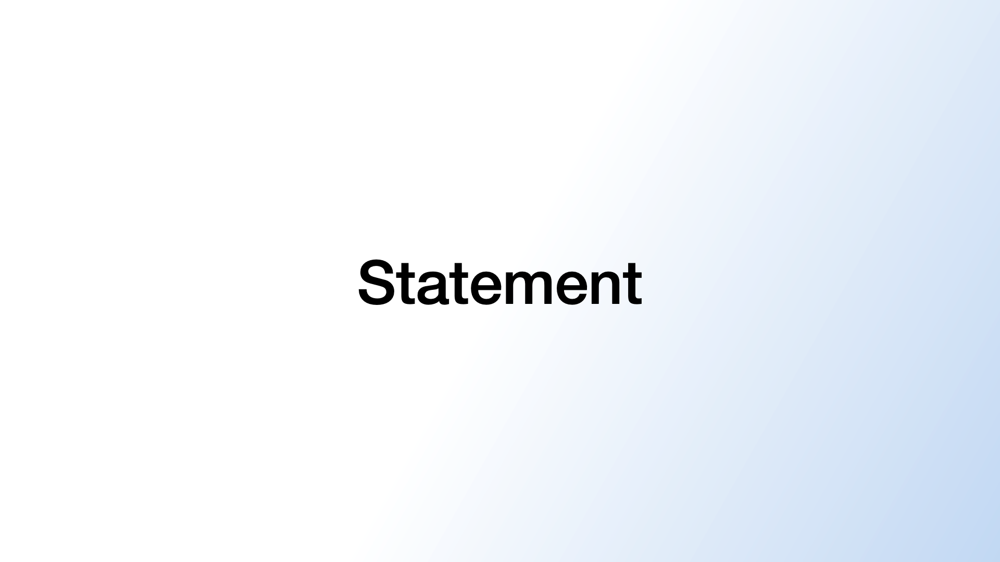

# Statement

## Example



```dart
KeynoteStatementSlide(
  statement: 'Statement',
)
```

## Properties

The `KeynoteStatementSlide` widget represents a statement slide from Keynote.

- `statement` (required): The text of the statement.
- `statementGradient`: The optional gradient to apply to the statement.
- `statementTextStyle`: The optional style for the statement text.
- `statementAlignment`: The optional alignment for the statement text.
- `padding`: The optional padding around the slide.
- `statementTitleReplacementWidget`: The optional replacement widget for the statement.
