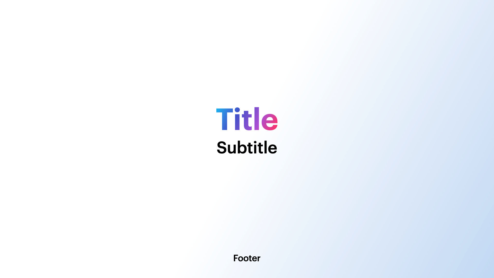

# Base

## Example



```dart
KeynoteTitleSlide(
  titleText: 'Title',
  subTitleText: 'Subtitle',
  footerText: 'Footer',
  titleGradient: KeynoteGradients.titleSlideGradient,
  titleStyle: KeynoteTextstyles.title(),
  subtitleStyle: KeynoteTextstyles.subtitle(),
  footerStyle: KeynoteTextstyles.footer(),
)
```

## Properties

The `KeynoteTitleSlide` widget represents a title slide from Keynote. It consists of a main title, an optional subtitle, and a footer.

- `titleText` (required): The main title of the slide.
- `subTitleText`: The subtitle of the slide.
- `footerText`: The footer text of the slide.
- `titleGradient`: An optional gradient that can be applied to the title text.
- `titleStyle`: The style for the title text.
- `subtitleStyle`: The style for the subtitle text.
- `footerStyle`: The style for the footer text.
- `titleAlignment`: The alignment of the title text within the slide.
- `subtitleAlignment`: The alignment of the subtitle text within the slide.
- `footerAlignment`: The alignment of the footer text within the slide.
- `titleSubTitleSpacing`: A widget that provides spacing between the title and subtitle.
- `footerBottomSpacing`: A widget that provides spacing below the footer text.
- `padding`: The padding around the slide content.
- `headerFlexUnits`: The flex units for the header section of the slide.
- `bodyFlexUnits`: The flex units for the body section of the slide.
- `footerFlexUnits`: The flex units for the footer section of the slide.
- `titleWidgetReplacement`: A widget that can replace the default title text widget.
- `subtitleWidgetReplacement`: A widget that can replace the default subtitle text widget.
- `footerWidgetReplacement`: A widget that can replace the default footer text widget.
- `animationIndex`: The index of the slide for animation purposes.
- `animationArguments`: Additional animation settings for the slide.
