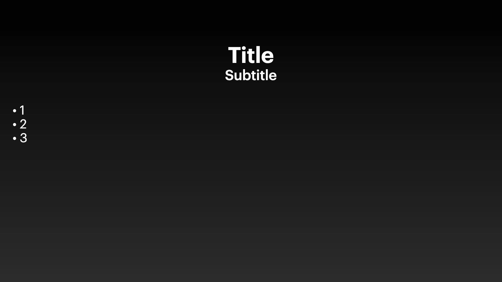

# Variations

## Variation 1

### Preview



```dart
KeynoteTitleAndBulletsSlideVariants.variantOne(
  titleText: 'Title',
  subTitleText: 'Subtitle',
  bulletPoints: ['1', '2', '3'],
)
```

### Constructor

```dart
KeynoteTitleAndBulletsSlide variantOne({
    required String titleText,
    required String subTitleText,
    required List<String>? bulletPoints,
    int? animationIndex,
    AnimationArguments? animationArguments,
  }) =>
      KeynoteTitleAndBulletsSlide(
        titleText: titleText,
        subTitleText: subTitleText,
        bulletPoints: bulletPoints,
        bullets: ListBullets.circle,
        titleStyle: KeynoteTextstyles.titleSmall(),
        subtitleStyle: KeynoteTextstyles.subtitleSmall(),
        bulletTextStyle: KeynoteTextstyles.body(),
        titleAlignment: Alignment.bottomCenter,
        subtitleAlignment: Alignment.topCenter,
        bulletPointsAlignment: Alignment.topLeft,
        animationIndex: animationIndex,
        animationArguments: animationArguments,
      )
```

## Variation 2

### Preview


```dart
KeynoteTitleAndBulletsSlideVariants.variantTwo(
  titleText: 'Title',
  subTitleText: 'Subtitle',
  bulletPoints: ['1', '2', '3'],
)
```

### Constructor

```dart
KeynoteTitleAndBulletsSlide variantTwo({
    required String titleText,
    required String subTitleText,
    required List<String>? bulletPoints,
    int? animationIndex,
    AnimationArguments? animationArguments,
  }) =>
      KeynoteTitleAndBulletsSlide(
        titleText: titleText,
        subTitleText: subTitleText,
        bulletPoints: bulletPoints,
        bullets: ListBullets.circle,
        titleStyle: KeynoteTextstyles.titleSmall(),
        subtitleStyle: KeynoteTextstyles.subtitle(),
        bulletTextStyle: KeynoteTextstyles.body(),
        titleAlignment: Alignment.bottomLeft,
        subtitleAlignment: Alignment.topLeft,
        bulletPointsAlignment: Alignment.topLeft,
        animationIndex: animationIndex,
        animationArguments: animationArguments,
      )
```
