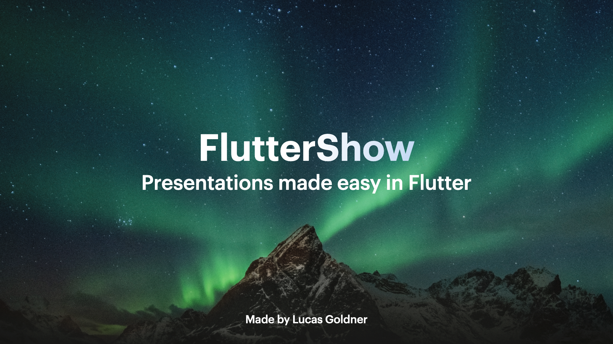

# Variations

## Variation 1

### Preview



```dart
KeynoteTitleAndPhotoSlideVariants.variantOne(
  image: Image.asset(
    'path_to_asset',
      fit: BoxFit.fill,
      height: size.height,
      width: size.width,
    ),
    titleText: t.flutterShow,
    subTitleText: t.presentationsInFlutter,
    headingText: t.author,
    gradient: FSGradients.background,
)
```

### Constructor

```dart
  KeynoteTitleAndPhotoSlide variantOne({
    required String titleText,
    required Widget image,
    required String subTitleText,
    required String headingText,
    required Gradient titleGradient,
    TextStyle? titleStyle,
    TextStyle? subtitleStyle,
    TextStyle? headingStyle,
    Alignment? titleAlignment,
    Alignment? subtitleAlignment,
    Alignment? headingAlignment,
    TextAlign? titleTextAlignment,
    TextAlign? subtitleTextAlignment,
    TextAlign? headingTextAlignment,
    Widget? titleSubTitleSpacing,
    Widget? headingBottomSpacing,
    EdgeInsets? padding,
    int? headerFlexUnits,
    int? bodyFlexUnits,
    int? headingFlexUnits,
    Widget? titleWidgetReplacement,
    Widget? subtitleWidgetReplacement,
    Widget? headingWidgetReplacement,
    Widget? imageWidgetReplacement,
    int? animationIndex,
    AnimationArguments? animationArguments,
  }) =>
      KeynoteTitleAndPhotoSlide(
        titleText: titleText,
        subTitleText: subTitleText,
        headingText: headingText,
        titleGradient: titleGradient,
        titleStyle: titleStyle ?? KeynoteTextstyles.title(),
        subtitleStyle: subtitleStyle ?? KeynoteTextstyles.subtitle(),
        headingStyle: headingStyle ?? KeynoteTextstyles.heading(),
        titleAlignment: titleAlignment ?? Alignment.bottomCenter,
        subtitleAlignment: subtitleAlignment ?? Alignment.topCenter,
        headingAlignment: headingAlignment ?? Alignment.bottomCenter,
        titleTextAlignment: titleTextAlignment,
        subtitleTextAlignment: subtitleTextAlignment,
        headingTextAlignment: headingTextAlignment,
        titleSubTitleSpacing: titleSubTitleSpacing,
        headingBottomSpacing: headingBottomSpacing,
        padding: padding,
        headerFlexUnits: headerFlexUnits,
        bodyFlexUnits: bodyFlexUnits,
        headingFlexUnits: headingFlexUnits,
        titleWidgetReplacement: titleWidgetReplacement,
        subtitleWidgetReplacement: subtitleWidgetReplacement,
        headingWidgetReplacement: headingWidgetReplacement,
        imageWidgetReplacement: imageWidgetReplacement,
        image: image,
        variant: Variants.one,
        animationIndex: animationIndex,
        animationArguments: animationArguments,
      );
```

## Variation 2

### Preview


```dart
KeynoteTitleAndPhotoSlideVariants.variantTwo(
  image: Image.asset(
    'path_to_asset',
    fit: BoxFit.fill,
    height: size.height,
    width: size.width,
  ),
  titleText: t.flutterShow,
  subTitleText: t.presentationsInFlutter,
  headingText: t.author,
)
```

### Constructor

```dart
  KeynoteTitleAndPhotoSlide variantTwo({
    required String titleText,
    required String subTitleText,
    required String headingText,
    required Widget image,
    TextStyle? titleStyle,
    TextStyle? subtitleStyle,
    TextStyle? headingStyle,
    Alignment? titleAlignment,
    Alignment? subtitleAlignment,
    Alignment? headingAlignment,
    TextAlign? titleTextAlignment,
    TextAlign? subtitleTextAlignment,
    TextAlign? headingTextAlignment,
    Widget? titleSubTitleSpacing,
    Widget? headingBottomSpacing,
    EdgeInsets? padding,
    int? headerFlexUnits,
    int? bodyFlexUnits,
    int? headingFlexUnits,
    Widget? titleWidgetReplacement,
    Widget? subtitleWidgetReplacement,
    Widget? headingWidgetReplacement,
    Widget? imageWidgetReplacement,
    int? animationIndex,
    AnimationArguments? animationArguments,
  }) =>
      KeynoteTitleAndPhotoSlide(
        titleText: titleText,
        subTitleText: subTitleText,
        headingText: headingText,
        titleStyle: titleStyle ?? KeynoteTextstyles.title(),
        subtitleStyle: subtitleStyle ?? KeynoteTextstyles.subtitle(),
        headingStyle: headingStyle ?? KeynoteTextstyles.heading(),
        titleAlignment: titleAlignment ?? Alignment.bottomLeft,
        subtitleAlignment: subtitleAlignment ?? Alignment.topLeft,
        headingAlignment: headingAlignment ?? Alignment.topLeft,
        titleTextAlignment: titleTextAlignment,
        subtitleTextAlignment: subtitleTextAlignment,
        headingTextAlignment: headingTextAlignment,
        titleSubTitleSpacing: titleSubTitleSpacing,
        headingBottomSpacing: headingBottomSpacing,
        padding: padding,
        headerFlexUnits: headerFlexUnits,
        bodyFlexUnits: bodyFlexUnits,
        headingFlexUnits: headingFlexUnits,
        titleWidgetReplacement: titleWidgetReplacement,
        subtitleWidgetReplacement: subtitleWidgetReplacement,
        headingWidgetReplacement: headingWidgetReplacement,
        imageWidgetReplacement: imageWidgetReplacement,
        image: image,
        variant: Variants.two,
        animationIndex: animationIndex,
        animationArguments: animationArguments,
      );
```
