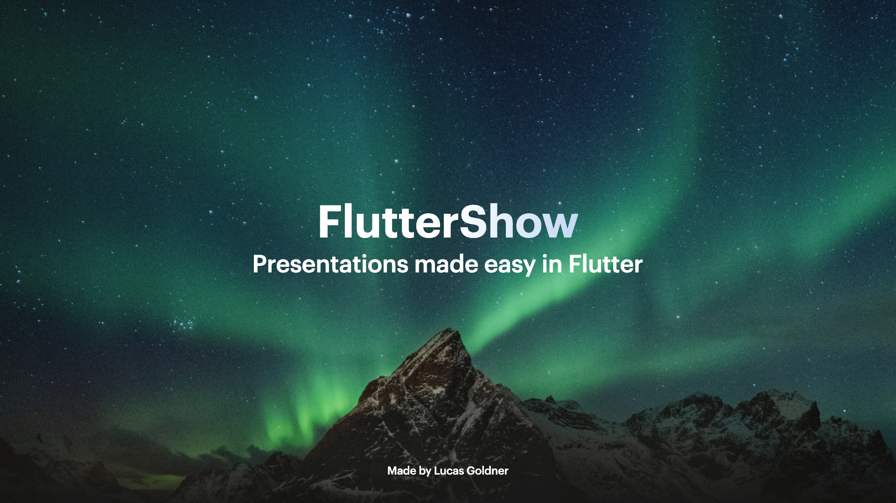

# Base

## Example



```dart
final size = MediaQuery.sizeOf(context);

KeynoteTitleAndPhotoAltSlide(
    image: Image.asset(
    'path_to_asset',
    fit: BoxFit.fill,
    height: size.height,
    width: size.width,
  ),
  titleText: t.flutterShow,
  subTitleText: t.presentationsInFlutter,
  titleStyle: FSTextStyles.title(),
  subtitleStyle: FSTextStyles.regularText(color: Colors.white),
)
```

## Properties

The `KeynoteTitleAndPhotoAltSlide` widget represents a title and photo alt slide from Keynote.

- `titleText` (required): The main title displayed on the slide.
- `subTitleText` (required): The optional subtitle displayed below the title.
- `image` (required): The main image displayed on the slide.
- `titleStyle`: The style for the title text.
- `subtitleStyle`: The style for the subtitle text.
- `titleAlignment`: The alignment of the title within the slide.
- `subtitleAlignment`: The alignment of the subtitle within the slide.
- `padding`: The padding around the slide.
- `titleSubTitleSpacing`: The spacing between the title and subtitle.
- `titleWidgetReplacement`: A custom widget that replaces the default title widget.
- `subtitleWidgetReplacement`: A custom widget that replaces the default subtitle widget.
- `imageWidgetReplacement`: A custom widget that replaces the default image widget.
- `animationIndex`: The order of appearance for animated elements.
- `animationArguments`: Additional configuration for the animation.
