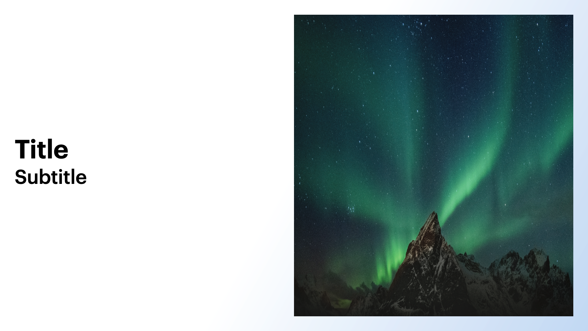

# Variations

## Variation 1

### Preview


```dart
final size = MediaQuery.sizeOf(context);

KeynoteTitleAndPhotoAltSlideVariants.variantOne(
  image: Image.asset(
    'path_to_image',
    fit: BoxFit.fill,
    height: size.height,
    width: size.width,
  ),
  titleText: 'Title',
  subTitleText: 'Subtitle',
)
```

### Constructor

```dart
KeynoteTitleAndPhotoAltSlide variantOne({
    required String titleText,
    required String subTitleText,
    required Widget image,
    int? animationIndex,
    AnimationArguments? animationArguments,
  }) =>
      KeynoteTitleAndPhotoAltSlide(
        image: image,
        titleText: titleText,
        subTitleText: subTitleText,
        titleStyle: KeynoteTextstyles.titleSmall(),
        subtitleStyle: KeynoteTextstyles.subtitle(),
        animationIndex: animationIndex,
        animationArguments: animationArguments,
      )
```

## Variation 2

### Preview



```dart
KeynoteTitleAndPhotoAltSlideVariants.variantTwo(
  image: Image.asset(
    'path_to_asset',
    fit: BoxFit.fill,
    height: size.height,
    width: size.width,
  ),
  titleText: 'Title',
  subTitleText: 'Subtitle',
)
```

### Constructor

```dart
KeynoteTitleAndPhotoAltSlide variantTwo({
    required String titleText,
    required String subTitleText,
    required Widget image,
    int? animationIndex,
    AnimationArguments? animationArguments,
  }) =>
      KeynoteTitleAndPhotoAltSlide(
        image: image,
        titleText: titleText,
        subTitleText: subTitleText,
        titleAlignment: Alignment.bottomLeft,
        subtitleAlignment: Alignment.topLeft,
        padding: allPadding48,
        titleStyle: KeynoteTextstyles.titleSmall(),
        subtitleStyle: KeynoteTextstyles.subtitle(),
        animationIndex: animationIndex,
        animationArguments: animationArguments,
      )
```
