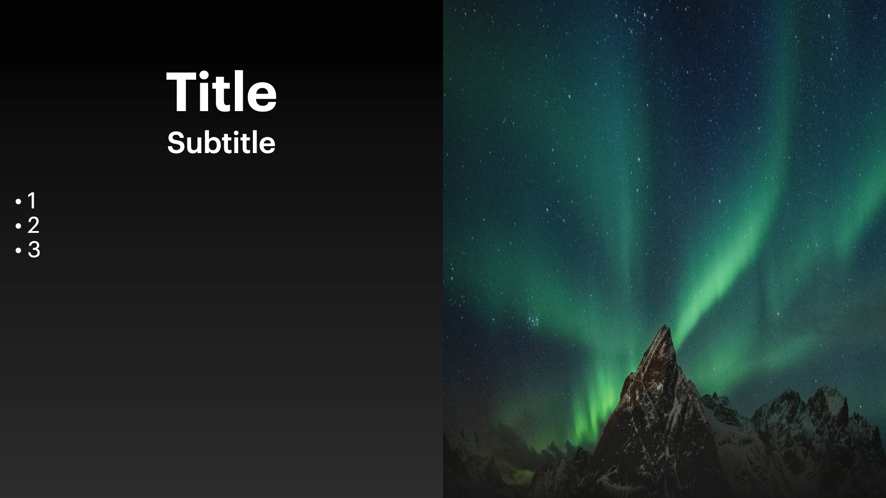

# Base

## Example



```dart
KeynoteTitleBulletAndPhotoSlide(
    titleText: 'Title',
    subTitleText: 'Subtitle',
    image: Image.asset(
      'path_to_asset',
      fit: BoxFit.fill,
      height: size.height,
      width: size.width,
  ),
  bulletPoints: const ['1', '2', '3'],
  titleStyle: KeynoteTextstyles.title(),
  subtitleStyle: KeynoteTextstyles.subtitle(),
  bulletTextStyle: KeynoteTextstyles.body(),
  bulletPointsPadding: horizontalPadding32,
)
```

## Properties

The `KeynoteTitleBulletAndPhotoSlide` widget represents a title bullet and photo slide from Keynote. It consists of a main title, an optional subtitle, an image, and bullet points.

- `titleText` (required): The main title displayed on the slide.
- `subTitleText` (required): The optional subtitle displayed below the title.
- `image` (required): The main image displayed on the slide.
- `bulletPoints` (required): The bullet points displayed on the slide.
- `bullets`: The style of the bullet points.
- `titleStyle`: The style for the title text.
- `subtitleStyle`: The style for the subtitle text.
- `bulletTextStyle`: The style for the bullet point text.
- `titleAlignment`: The alignment of the title text within its space.
- `subtitleAlignment`: The alignment of the subtitle text within its space.
- `bulletPointsAlignment`: The alignment of the bullet points within their space.
- `titleTextAlignment`: The text alignment of the title text.
- `subtitleTextAlignment`:The text alignment of the subtitle text.
- `bulletTextAlignment`: The alignment of the bullet text within each bullet point.
- `bulletPointsPadding`: The padding around the bullet points.
- `padding`: The padding around the entire slide.
- `titleSubTitleSpacing`: The spacing between the title and subtitle.
- `subtitleBulletSpacing`: The spacing between the subtitle and bullet points.
- `headerFlexUnits`: The number of flex units for the header section.
- `bodyFlexUnits`: The number of flex units for the body section.
- `footerFlexUnits`: The number of flex units for the footer section.
- `titleWidgetReplacement`: A replacement widget for the title text.
- `subtitleWidgetReplacement`: A replacement widget for the subtitle text.
- `imageWidgetReplacement`: A replacement widget for the image.
- `bulletPointsWidgetReplacement`: A replacement widget for the bullet points.
- `animationIndex`: The index of the slide for animations.
- `animationArguments`: The configuration for the slide animations.
