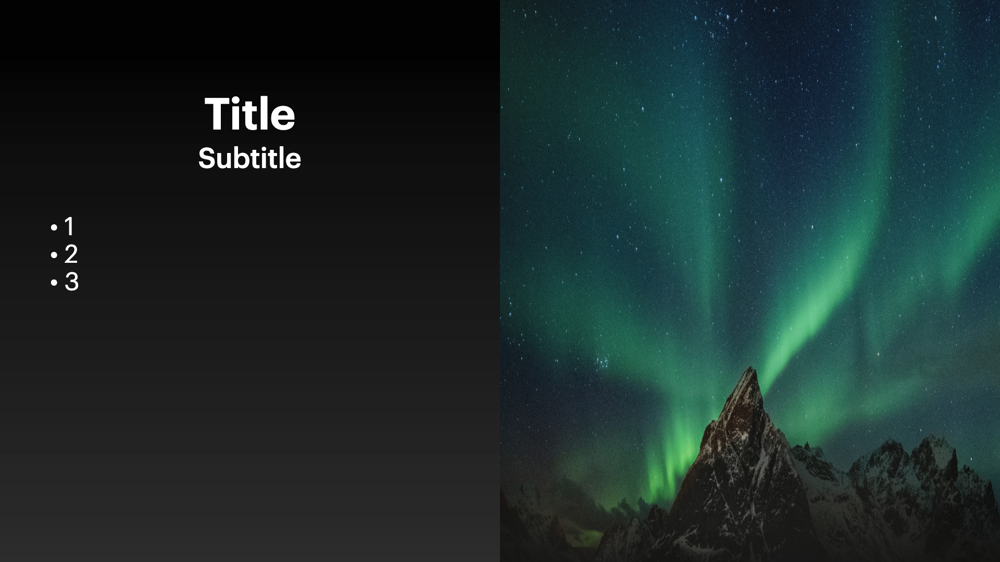
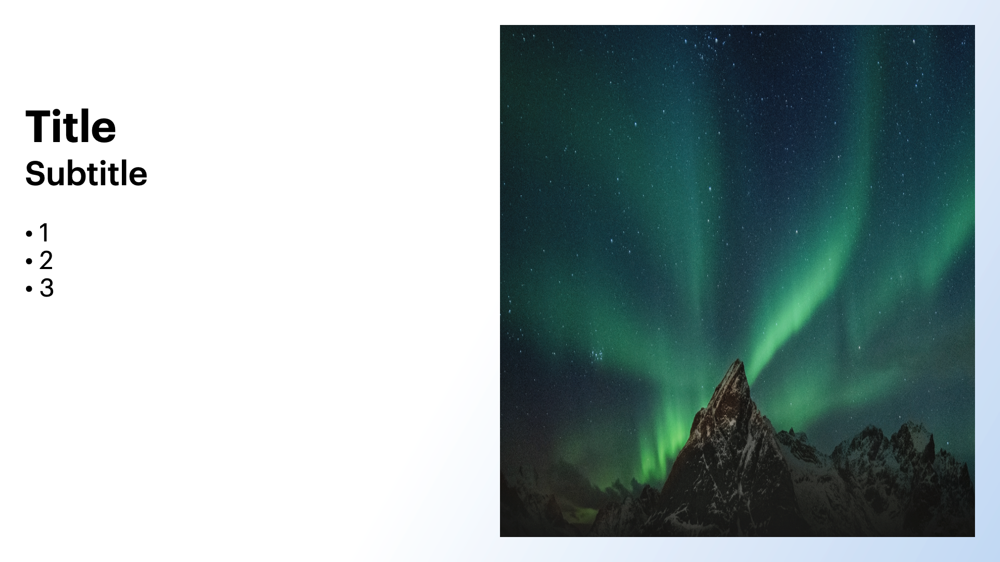

# Variations

## Variation 1

### Preview



```dart
KeynoteTitleAndPhotoSlideVariants.variantOne(
  image: Image.asset(
    'path_to_asset',
      fit: BoxFit.fill,
      height: size.height,
      width: size.width,
    ),
    titleText: t.flutterShow,
    subTitleText: t.presentationsInFlutter,
    headingText: t.author,
    gradient: FSGradients.background,
)
```

### Constructor

```dart
KeynoteTitleBulletAndPhotoSlide variantOne({
    required String titleText,
    required String subTitleText,
    required Widget image,
    required List<String> bulletPoints,
    int? animationIndex,
    AnimationArguments? animationArguments,
  }) =>
      KeynoteTitleBulletAndPhotoSlide(
        image: image,
        titleText: titleText,
        subTitleText: subTitleText,
        titleStyle: KeynoteTextstyles.titleSmall(),
        subtitleStyle: KeynoteTextstyles.subtitleSmall(),
        bulletTextStyle: KeynoteTextstyles.body(),
        bulletPoints: bulletPoints,
        bulletPointsPadding: horizontalPadding48 + horizontalPadding48,
        titleAlignment: Alignment.bottomCenter,
        subtitleAlignment: Alignment.topCenter,
        animationIndex: animationIndex,
        animationArguments: animationArguments,
      )
```

## Variation 2

### Preview



```dart
KeynoteTitleBulletAndPhotoSlideVariants.variantTwo(
  titleText: 'Title',
  subTitleText: 'Subtitle',
  image: Image.asset(
    'path_to_asset',
    fit: BoxFit.fill,
    height: size.height,
    width: size.width,
  ),
  bulletPoints: const ['1', '2', '3'],
)
```

### Constructor

```dart
KeynoteTitleBulletAndPhotoSlide variantTwo({
    required String titleText,
    required String subTitleText,
    required Widget image,
    required List<String> bulletPoints,
    int? animationIndex,
    AnimationArguments? animationArguments,
  }) =>
      KeynoteTitleBulletAndPhotoSlide(
        image: image,
        titleText: titleText,
        subTitleText: subTitleText,
        bulletPoints: bulletPoints,
        titleAlignment: Alignment.bottomLeft,
        subtitleAlignment: Alignment.topLeft,
        padding: allPadding48,
        titleStyle: KeynoteTextstyles.titleSmall(),
        subtitleStyle: KeynoteTextstyles.subtitle(),
        bulletTextStyle: KeynoteTextstyles.body(),
        animationIndex: animationIndex,
        animationArguments: animationArguments,
      )
```
