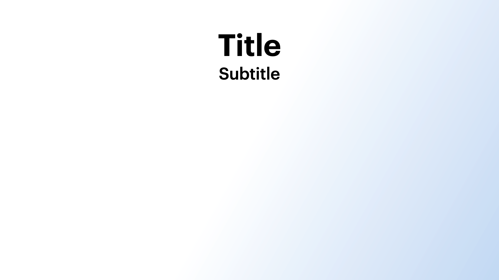

# Base

## Example



```dart
KeynoteTitleOnlySlide(
  titleText: 'Title',
  subTitleText: 'Subtitle',
  titleStyle: KeynoteTextstyles.title(),
  subtitleStyle: KeynoteTextstyles.subtitle(),
)
```

## Properties

The `KeynoteTitleOnlySlide` widget represents a title-only slide from Keynote. It consists of a main title and an optional subtitle.

- `titleText` (required): The main title displayed on the slide.
- `subTitleText`: An optional subtitle displayed below the title.
- `titleStyle`: The style applied to the title text. If not provided, the default style is used.
- `subtitleStyle`: The style applied to the subtitle text. If not provided, the default style is used.
- `titleAlignment`: The alignment of the title text within its container. If not provided, the default alignment is used.
- `subtitleAlignment`: The alignment of the subtitle text within its container. If not provided, the default alignment is used.
- `titleTextAlignment`: The text alignment for the slide title.
- `subtitleTextAlignment`: The text alignment for the slide subtitle.
- `titleSubTitleSpacing`: The spacing widget placed between the title and subtitle. If not provided, the default spacing is used.
- `padding`: The padding applied to the slide's content. If not provided, the default padding is used.
- `headerFlexUnits`: The number of flex units for the header section. If not provided, the default number of units is used.
- `bodyFlexUnits`: The number of flex units for the body section. If not provided, the default number of units is used.
- `titleWidgetReplacement`: A replacement widget for the title text. If provided, it will be used instead of the default text widget.
- `subtitleWidgetReplacement`: A replacement widget for the subtitle text. If provided, it will be used instead of the default text widget.
- `animationIndex`: The index of the slide for animations.
- `animationArguments`: The configuration for the slide animations.
