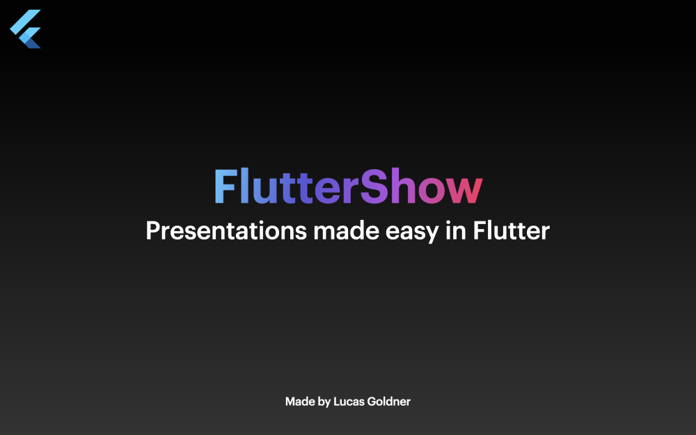
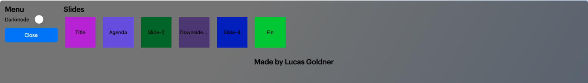

# Introduction

Unleash your creativity with presentations like never before! FlutterShow⚡️ is an easy-to-use framework built in Flutter for crafting engaging and interactive presentations.

Check out the full documentation showcasing all slides here: 🚧 Coming soon...🚧



## General Information

FlutterShow consists of two main packages: `fluttershow_base` and `fluttershow_keynote`:

- [fluttershow_base](https://pub.dev/packages/fluttershow_base) contains most of the pre-built widgets that are used in `fluttershow_keynote`, but can also be used to make custom slides.
- [fluttershow_keynote](https://pub.dev/packages/fluttershow_keynote) is currently the default package and implements all basic slides with variations of the popular presentation software Keynote.
- The project utilizes riverpod hooks for state management, providing a simple and quick experience for managing your state.
- The project is designed to be easily expandable and customizable according to your preferences. You can switch libraries like `intl` to `easy_localizations` or use `fluttergen` for asset organization.

## Project Setup

To run your show, you can either use the pre-built `launch.json` file or follow these commands:

```bash
# Get dependencies
$ flutter pub get

# If language files were not generated
$ flutter pub run intl_utils:generate

# Run the app (for example on macOS)
$ flutter run -d macos
```

## Awesome features

### Menu

The **Menu** _(Open using M key)_: Toggle dark/light mode depending on the location you are presenting at or quickly jump between your slides.



### Animations

Most slides and prebuilt widgets can be animated for a smoother experience. Simply pass an `animationIndex` parameter to enable animation on the desired slide or widget.
In addition to animating individual slides and widgets, you can also animate the transitions between slides. An example of slide transition animation can be found in [`lib/slides/03_motivation/view/motivation.dart`](https://github.com/lucas-goldner/FlutterShow/tree/main/lib/slides/03_motivation/view/motivation.dart) file.

### Rebindable Keys

You can easily rebind your keys for actions like navigating to the next or previous slide and opening the menu. Simply edit the actions in [`lib/presentation/config/key_actions.dart`](https://github.com/lucas-goldner/FlutterShow/tree/main/lib/presentation/config/key_actions.dart).

## Project Structure

Remember **FlutterShow⚡️** can be adjusted to your preferences, but this is the basic structure that was intended:

```
|____slides                           # Directory in which slides are saved
| |____01_title
| | |____view                         # Directory where complete slide only should be stored
| | | |____title_slide.dart
| | |____widgets                      # Directory in which helper widgets can be saved
| | | |____title_slide_overlay.dart
| | ...
| |____06_outro
|
|____main.dart                        # Main file of project
|
|____styles                           # Styles folder contains some basic
| |____fs_text_styles.dart            # text_styles, colors and themes.
| |____fs_colors.dart
| |____theme
| | |____light_theme.dart
| | |____dark_theme.dart
| |____fs_gradients.dart
| |____fs_style_constants.dart
|
|
|____presentation                     # Presentation specific files
| |____config
| | |____contants.dart
| | |____pages_of_presentation.dart   # Important! file that determines slides used by presentation
| | |____key_actions.dart             # Key Bindings for each action
| |____provider
| | |____presentation_controller_provider.dart  # Presentation controller that stores state
| |____model
| | |____presentation.dart            # Presentation model used by controller
| |____view
| | |____presentation_slides.dart
| |____widgets
| | |____menu.dart
| | |____menu_option.dart
| | |____slide_show.dart
```
