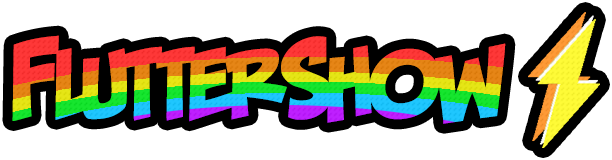
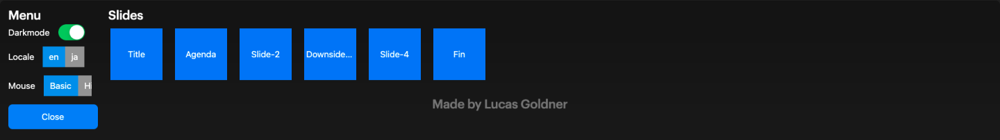
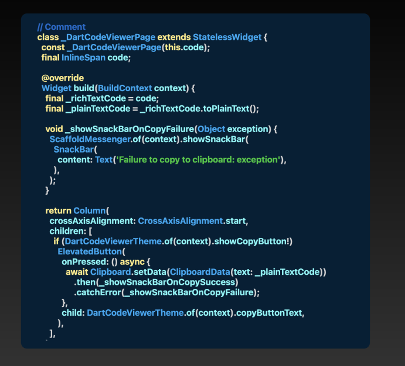
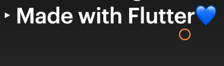

# Introduction to FlutterShow⚡️


[](https://pub.dev/packages/very_good_analysis)
[](https://opensource.org/licenses/MIT)

Unleash your creativity with presentations like never before! FlutterShow⚡️ is an easy-to-use framework built in Flutter
for crafting engaging and interactive presentations.
**Full documentation 📄** showcasing all slides and code snippets to **speed up your development time** available here!

## Project Setup

### Usage

Feel free to either **fork** or **clone** the repo, whatever you prefer.
Select branch `main` for latest stable version.
Select latest release branch `release/1.2.0` for newest features.

### Running FlutterShow⚡️

```bash
# (Optional) Checkout release branch for newest features
$ git checkout release/1.2.0

# Get dependencies
$ flutter pub get

# If language files were not generated
$ flutter pub run intl_utils:generate

# (Optional) If you want to run it on macOS
$ cd macos && pod install && cd ..

# Run the app (for example on macOS) OR use the pre-built `launch.json`
$ flutter run -d macos
```

## Getting Started

When you first explore the project, you'll find some sample slides that demonstrate how slides are built in this project.
You have the option to use these as templates or completely discard them to begin anew.

**🚨Check out this guide** to create **your first slide🚨** -> https://flutter-show-docs.vercel.app/docs/quick-start
Once the application is running, use the _**M key**_ to open the **Menu**!

## General Information

FlutterShow consists of two main packages: `fluttershow_base` and `fluttershow_keynote`:

- [fluttershow_base](https://github.com/lucas-goldner/fluttershow_base) contains most of the pre-built widgets that are used in `fluttershow_keynote`, but can also be used to make custom slides.
- [fluttershow_keynote](https://github.com/lucas-goldner/fluttershow_keynote) is currently the default package and implements all basic slides with variations of the popular presentation software Keynote.
- FlutterShow⚡️ uses riverpod hooks for state management, providing a simple and quick experience for managing your state.
- FlutterShow⚡️ is designed to be easily expandable and customizable according to your preferences. You can switch libraries like `intl` to `easy_localizations` or use `fluttergen` for asset organization.

Any more questions?
Check the docs 📄: https://flutter-show-docs.vercel.app/#/
Or ask them in our discord 🗣️: https://discord.gg/xC6wtbzZnP

## Awesome features 😱

### Menu

The **Menu** _(Open using **M key**)_: Toggle dark/light mode depending on the location you are presenting at or quickly jump between your slides.



### Animations

Most slides and prebuilt widgets can be animated for a smoother experience. Simply pass an `animationIndex` parameter to enable animation on the desired slide or widget.
In addition to animating individual slides and widgets, you can also animate the transitions between slides. An example of slide transition animation can be found in [`lib/slides/03_motivation/view/motivation.dart`](lib/slides/03_motivation/view/motivation.dart) file.

### Code Display

Use the `Code Display` to present your beautiful code:



### Rebindable Keys

You can easily rebind your keys for actions like navigating to the next or previous slide and opening the menu. Simply edit the actions in [`lib/presentation/config/key_actions.dart`](lib/presentation/config/key_actions.dart).

### Toggle Cursor

Using the **O key** the mouse cursor can be hidden or shown again. Optionally it is possible to set a custom cursor as it can be seen here:



## Talks using FlutterShow⚡️

| Talk                                             | Speaker                                           | Link                                                                                           | Version used |
| :----------------------------------------------- | :------------------------------------------------ | :--------------------------------------------------------------------------------------------- | :----------- |
| Comparing ways of accessing native functionality | [Lucas Goldner](https://twitter.com/LucasGoldner) | [Watch](https://www.droidcon.com/2023/08/07/comparing-ways-of-accessing-native-functionality/) | Beta         |
| Introdução ao Flutter                            | [Jessica Pereira](https://twitter.com/Jeeh__XuXu) | [Watch](https://www.youtube.com/live/9GLDOE9SDrM?feature=share&t=551)                          | 1.0          |

## Project Structure

Remember **FlutterShow⚡️** can be adjusted to your preferences, but this is the basic structure that was intended:

```
|____slides                           # Directory in which slides are saved
| |____01_title
| | |____view                         # Directory where complete slide only should be stored
| | | |____title_slide.dart
| | |____widgets                      # Directory in which helper widgets can be saved
| | | |____title_slide_overlay.dart
| | ...
| |____06_outro
|
|____main.dart                        # Main file of project
|
|____styles                           # Styles folder contains some basic
| |____fs_text_styles.dart            # text_styles, colors and themes.
| |____fs_colors.dart
| |____theme
| | |____light_theme.dart
| | |____dark_theme.dart
| |____fs_gradients.dart
| |____fs_style_constants.dart
|
|
|____presentation                     # Presentation specific files
| |____config
| | |____contants.dart
| | |____pages_of_presentation.dart   # Important! file that determines slides used by presentation
| | |____key_actions.dart             # Key Bindings for each action
| |____provider
| | |____presentation_controller_provider.dart  # Presentation controller that stores state
| |____model
| | |____presentation.dart            # Presentation model used by controller
| |____view
| | |____presentation_slides.dart
| |____widgets
| | |____menu.dart
| | |____menu_option.dart
| | |____slide_show.dart
```

## Team

Want to talk to us?

[](https://discord.gg/xC6wtbzZnP)

Main author:

Lucas Goldner

[](https://twitter.com/LucasGoldner)
[](https://medium.com/@lucas.goldner)
[](https://github.com/lucas-goldner)

Team:

Fré Dumazy
[](https://twitter.com/FresidentDumazy)
[](https://github.com/dumazy)

Sai Rajendra Immadi
[](https://twitter.com/immadisairaj)
[](https://github.com/immadisairaj)
