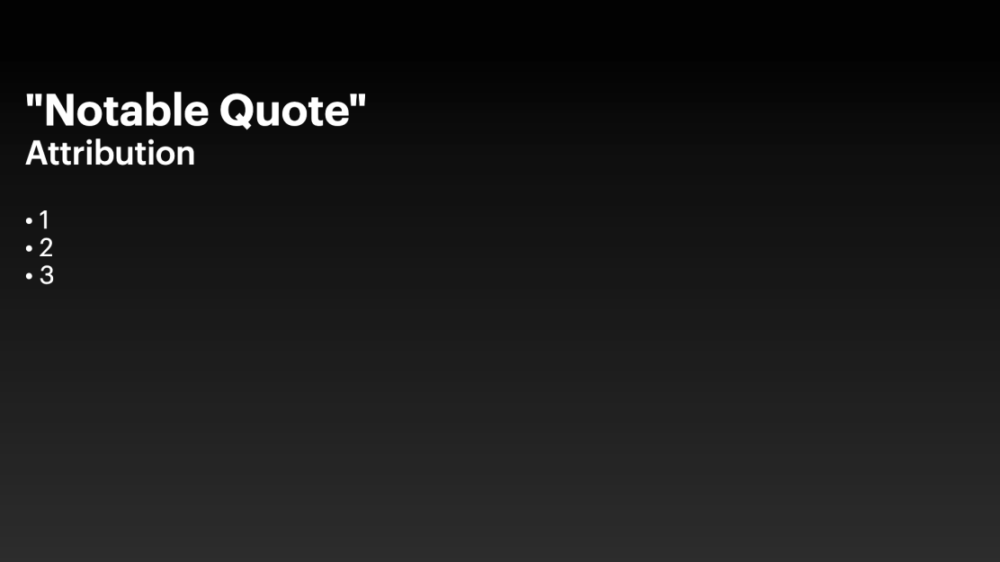

# Quickstart 🔥

Let's **add a new slide** to FlutterShow.

## Creating a new slide

1. When you first explore the project, you'll find some sample slides that demonstrate how slides are built in this project.
2. To create a new slide, add a new widget in the [`lib/slides`](https://github.com/lucas-goldner/FlutterShow/tree/main/lib/slides) directory.
3. Create a new folder. Lets call it `07_credits`
4. Now create a folder called `view` to store our finished slide there. Also create a `widgets` folder if you may create multiple widgets for your slide.
5. Now create your slide as you like. For demo purposes here a slide you can copy:

```dart
class CreditsSlide extends ConsumerWidget {
  const CreditsSlide({super.key});

  @override
  Widget build(BuildContext context, WidgetRef ref) {
    final controller = ref.watch(presentationController);

    return DecoratedBox(
      decoration: BoxDecoration(
        gradient: FSGradients.dynamicBackground(controller.brightness),
      ),
      child: Stack(
        children: [
          KeynoteTitleAndBulletsSlideVariants.variantTwo(
            titleText: '"Notable Quote"',
            subTitleText: 'Attribution',
            bulletPoints: ['1', '2', '3'],
          ),
        ],
      ),
    );
  }
}
```

**🎉 Tada you made your first slide 🎉**



## Adding the slide into the project

- Once you finish creating your slide, navigate to [`lib/presentation/config/pages_of_presentation.dart`](https://github.com/lucas-goldner/FlutterShow/tree/main/lib/presentation/config/pages_of_presentation.dart) and add a new member to the enum using your new widget.
- Reload the app, and your slide will appear in all its glory! 🔥

## Animating your slides

### Using the animationIndex

- Now that you created your first slide and are able to see it, it would be cool if its animated.
- First navigate back to [`lib/presentation/config/pages_of_presentation.dart`](https://github.com/lucas-goldner/FlutterShow/tree/main/lib/presentation/config/pages_of_presentation.dart) and set the items to 5.
  Since we have a title + subtitle and three bullet points that adds up to 5 elements, so we need to set it to 5.
- In order to get the current animation index we need to get if from the `presentationController`.
- That's it! Your slide will now be animated, try clicking through it.

```dart
class CreditsSlide extends ConsumerWidget {
  const CreditsSlide({super.key});

  @override
  Widget build(BuildContext context, WidgetRef ref) {
    final controller = ref.watch(presentationController);

    return DecoratedBox(
      decoration: BoxDecoration(
        gradient: FSGradients.dynamicBackground(controller.brightness),
      ),
      child: Stack(
        children: [
          KeynoteTitleAndBulletsSlideVariants.variantTwo(
            titleText: '"Notable Quote"',
            subTitleText: 'Attribution',
            bulletPoints: ['1', '2', '3'],
            animationIndex: controller.animationIndex
          ),
        ],
      ),
    );
  }
}
```

### There's more!

- What if you could also animate the way the presentation is animated ?
- Just pass in an animationArgument. In this case we will use the `Animations.directionalAnimation`.

```dart
class CreditsSlide extends ConsumerWidget {
  const CreditsSlide({super.key});

  @override
  Widget build(BuildContext context, WidgetRef ref) {
    final controller = ref.watch(presentationController);

    return DecoratedBox(
      decoration: BoxDecoration(
        gradient: FSGradients.dynamicBackground(controller.brightness),
      ),
      child: Stack(
        children: [
          KeynoteTitleAndBulletsSlideVariants.variantTwo(
            titleText: '"Notable Quote"',
            subTitleText: 'Attribution',
            bulletPoints: ['1', '2', '3'],
            animationIndex: controller.animationIndex
            animationArguments: AnimationArguments(
              Animations.directionalAnimation,
              delay: 100,
              direction: DirectionalAnimationDirection.bottom,
              animationCurve: Curves.easeIn,
            ),
          ),
        ],
      ),
    );
  }
}
```

**🎉 And its done 🎉**

Now you have created a new slide, added it to the presentation and animated it.
The only thing left is to check out which kind of slides and components are available.
Have fun!
